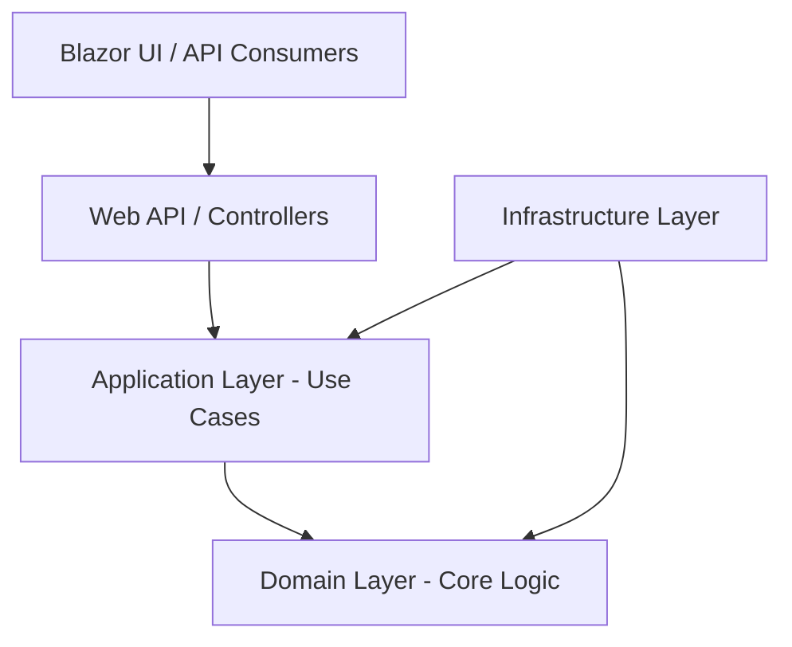

# 01 - Overall Architecture

This document describes the high-level architecture of **NkplmErp**, a banking-grade Enterprise Resource Planning (ERP) system.

## Architectural Principles

NkplmErp is built on three core architectural pillars:

1.  **Clean Architecture (Onion Architecture)**
2.  **Domain-Driven Design (DDD)**
3.  **Modular Monolith Strategy**

---

## 1. Clean Architecture

The system is organized into concentric layers where dependencies only point inward. This ensures that the core business logic (Domain) remains isolated from external concerns like databases, APIs, or UI frameworks.

### Layer Responsibilities
-   **Domain Layer**: Contains Entities, Value Objects, Domain Events, and Repository Interfaces. It has zero external dependencies.
-   **Application Layer**: Orchestrates Use Cases (Commands/Queries), DTOs, Mapping logic, and Validators.
-   **Infrastructure Layer**: Implements Repository Interfaces (EF Core), Mail Services, File Storage, and External API Integrations.
-   **Presentation Layer**: (API & Blazor) Entry points for users and external systems.

## 2. Domain-Driven Design (DDD)

We use DDD to manage the complexity of ERP domains (Accounting, Payroll, Inventory, etc.).

-   **Bounded Contexts**: Each module (e.g., Finance, HR) is treated as a separate bounded context with its own ubiquitous language.
-   **Aggregates**: Clusters of domain objects that can be treated as a single unit (e.g., an `Invoice` aggregate containing `InvoiceItems`).
-   **Domain Events**: Used for side effects across aggregates or bounded contexts (e.g., `PaymentReceived` triggering `LedgerEntry`).

## 3. Modular Monolith Strategy

NkplmErp is designed as a **Modular Monolith**. While it lives in a single solution for development simplicity, it is decoupled enough to be split into Microservices if needed.

-   **Internal Modules**: Each major ERP feature is a distinct module.
-   **Inter-Module Communication**: Ideally handled via an `In-Process Message Bus` or well-defined interfaces to avoid tight coupling.
-   **Database Separation**: Each module should ideally own its schema or set of tables.

## 4. Non-Functional Requirements (Banking Grade)

-   **Security**: Zero Trust architecture, strict RBAC/ABAC, and comprehensive audit logging.
-   **Performance**: Optimized for high-concurrency PostgreSQL operations.
-   **Scalability**: Stateless API design for horizontal scaling.
-   **Reliability**: Compensation logic for failed distributed transactions.
