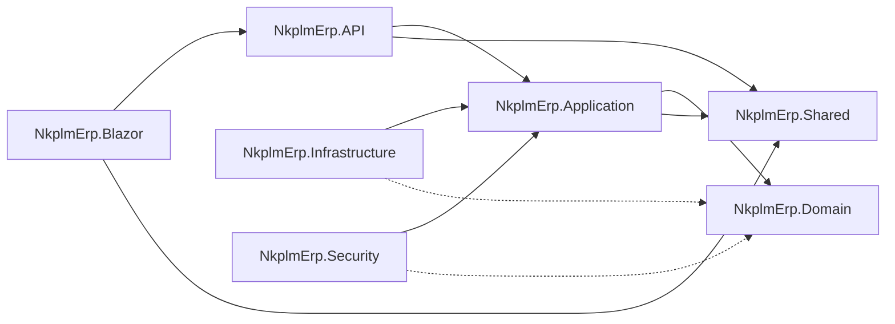

# 02 - Solution Structure

This document outlines the project structure of the **NkplmErp** solution and the responsibilities of each project.

## Solution Layout

The solution is organized into several projects following the Clean Architecture principles.

### Core Projects
-   **`NkplmErp.Domain`**: 
    -   The innermost layer.
    -   Contains heart of the business logic: Entities, Aggregates, Value Objects, Domain Exceptions, and Repository Interfaces.
    -   No dependencies on other projects or external libraries (except core .NET types).
-   **`NkplmErp.Application`**:
    -   Use Case orchestration.
    -   Contains Command/Query handlers (MediatR), DTOs, Mapping profiles (AutoMapper), and FluentValidators.
    -   Depends on `Domain`.
-   **`NkplmErp.Shared`**:
    -   Shared constants, enumerations, and utilitarian types used across both Application and Presentation layers.
    -   Common DTOs for API responses.

### Implementation Projects
-   **`NkplmErp.Infrastructure`**:
    -   External concerns and implementation of interfaces.
    -   Contains EF Core `DbContext`, Migrations, Repository Implementations, Email/SMS services, and Background Jobs.
    -   Depends on `Application`.
-   **`NkplmErp.Security`**:
    -   Dedicated project for "banking-grade" security concerns.
    -   Implements Identity logic, JWT generation, MFA handlers, Device Fingerprinting, and Encryption utilities.
    -   Depends on `Application` and `Domain`.

### Presentation Projects
-   **`NkplmErp.API`**:
    -   ASP.NET Core Web API.
    -   Contains Controllers, Swagger configuration, and Global Error Handling middleware.
    -   Serves as the backend for the Blazor frontend and external consumers.
-   **`NkplmErp.Blazor`**:
    -   Blazor WebAssembly or Server frontend.
    -   The main user interface for the ERP.

## Dependency Graph

## Naming Conventions
-   **Namespaces**: Follow the folder structure exactly (e.g., `NkplmErp.Application.Features.Invoices.Commands`).
-   **Interfaces**: Prefixed with `I` (e.g., `IInvoiceRepository`).
-   **Implementations**: Descriptive names (e.g., `EfInvoiceRepository`).
