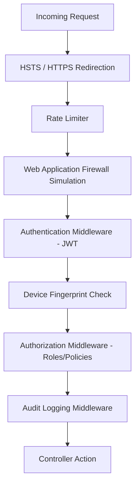

# 03 - Security Design

NkplmErp is designed with a **Security-First** mindset, adhering to banking-grade standards to ensure data integrity and confidentiality.

## 1. Authentication & Identity

The system uses **OpenID Connect (OIDC)** and **OAuth 2.0** for secure authentication.

-   **Identity Provider**: Built using ASP.NET Core Identity within the `NkplmErp.Security` project.
-   **JWT Tokens**: Use of signed JSON Web Tokens for stateless API authentication.
    -   Short-lived Access Tokens (e.g., 15 minutes).
    -   Secure, HttpOnly, SameSite Rotate Refresh Tokens.
-   **Multi-Factor Authentication (MFA)**:
    -   Mandatory for administrative and privileged financial roles.
    -   Supports TOTP (Google Authenticator) and Email/SMS OTP.

## 2. Authorization (RBAC & ABAC)

-   **Role-Based Access Control (RBAC)**: Fine-grained permissions (e.g., `invoice.create`, `payroll.view`).
-   **Attribute-Based Access Control (ABAC)**: Contextual rules (e.g., "User can only view invoices from their assigned branch during business hours").

## 3. Data Protection

-   **Encryption at Rest**:
    -   Sensitive database columns (e.g., Bank Account Numbers) are encrypted using AES-256.
    -   Database level Transparent Data Encryption (TDE) is recommended for production PostgreSQL.
-   **Encryption in Transit**:
    -   Strict HTTPS (TLS 1.2+) requirement for all communications.
    -   HSTS (HTTP Strict Transport Security) enabled.

## 4. Banking-Specific Protections

-   **Device Fingerprinting**: Capturing and validating device signatures to detect session hijacking.
-   **Rate Limiting**: IP-based and User-based throttling to prevent Brute Force and DoS attacks.
-   **Audit Logging (Immutable)**:
    -   Every state change is logged.
    -   Logs include: Timestamp, User ID, IP Address, Device Info, Before State, and After State.
    -   Logs are stored in a tamper-evident manner.

## 5. Security Middleware Pipeline

## 6. Implementation Notes
-   Secrets are never stored in `appsettings.json`. Use **Environment Variables** or **Azure Key Vault / AWS Secrets Manager**.
-   SQL Injection protection via EF Core parameterized queries.
-   Cross-Site Scripting (XSS) protection via Blazor's built-in encoding.
-   Cross-Site Request Forgery (CSRF) protection for the API.
