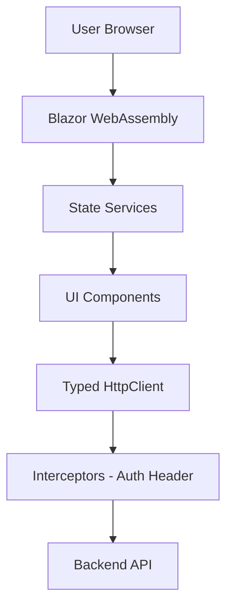

# 06 - Frontend Architecture (Blazor)

The frontend for NkplmErp is built with **Blazor**, providing a rich, single-page application (SPA) experience using C# and .NET.

## 1. Hosting Model

We use the **Blazor Auto** (or WASM) model:
-   **Initial Load**: Blazor Server for near-instant rendering.
-   **Subsequent Interaction**: Blazor WebAssembly (WASM) for client-side execution to reduce server load.
-   **Offline Support**: Progressive Web App (PWA) capabilities enabled.

## 2. State Management

-   **Scoped Services**: Used for simple state shared across pages in a single session.
-   **Persistent State**: LocalStorage is used for non-sensitive preferences (e.g., Theme, Sidebar state).
-   **Flux/Redux (Optional)**: If complex state transitions are needed, libraries like `Fluxor` may be introduced.

## 3. UI Framework & Component Library

-   **Vanilla CSS**: Custom design system for maximum control.
-   **Reusable Components**: Standardized UI elements (Buttons, Inputs, Modals, Grids) located in the `NkplmErp.Blazor/Shared/Components` folder.
-   **Dashboards**: Interactive charts using libraries like `Radzen.Blazor` or `Plotly.Blazor`.

## 4. Communication Layer

-   **HttpClient**: Typed clients used to communicate with the `NkplmErp.API`.
-   **Interceptors**: Automatic injection of JWT Bearer tokens and error notification handling.

## 5. Security in Frontend

-   **CascadingAuthenticationState**: Used to show/hide UI elements based on User Roles/Policies.
-   **Input Sanitization**: Leveraging Blazor's default protection against XSS.
-   **Sensitive Data**: Never stored in memory or local storage longer than needed.

## 6. Optimization

-   **Virtualization**: Using `Virtualize<T>` for large data grids.
-   **Lazy Loading**: Modules are loaded only when the user navigates to them.
-   **Pre-rendering**: Enabled to improve SEO and perceived performance.

